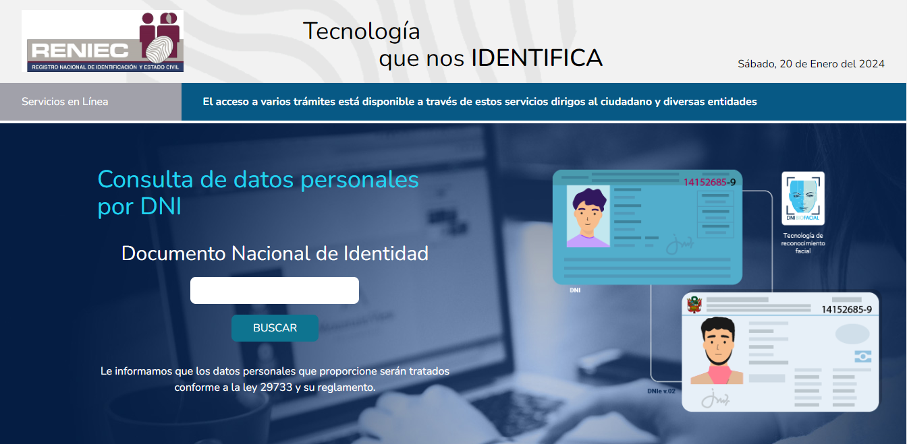
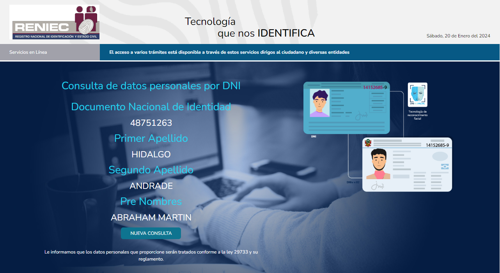

<h1 align="center">Consulta DNI - Proyecto académico</h1>

## Acerca del proyecto
El proyecto académico está basado en la página de la RENIEC, tiene como función la consulta de datos de un ciudadano a través de su número de DNI, está construido con el framework Laravel en su V9 y se utilizó la API de consulta DNI de Apis Net.

## Enlaces a documentación de tecnologias usadas

- [Laravel](https://laravel.com/docs/10.x).
- [APIS NET](https://apis.net.pe/consultar-dni-ruc.html).

## Capturas de pantalla del proyecto

  

